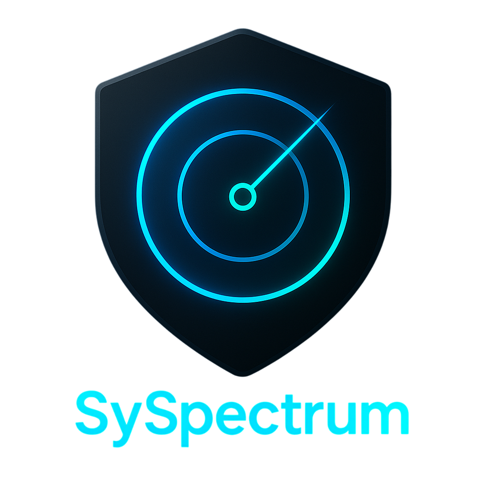
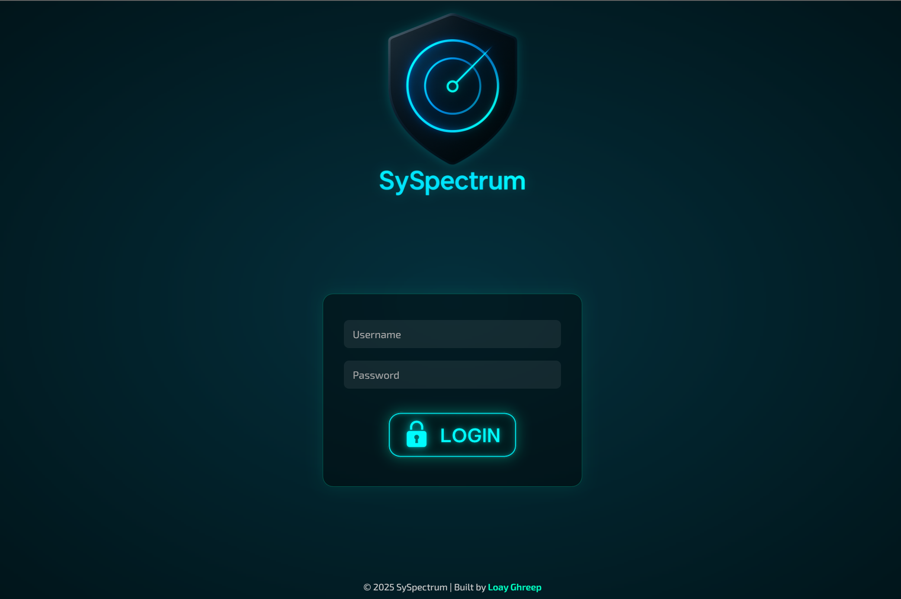
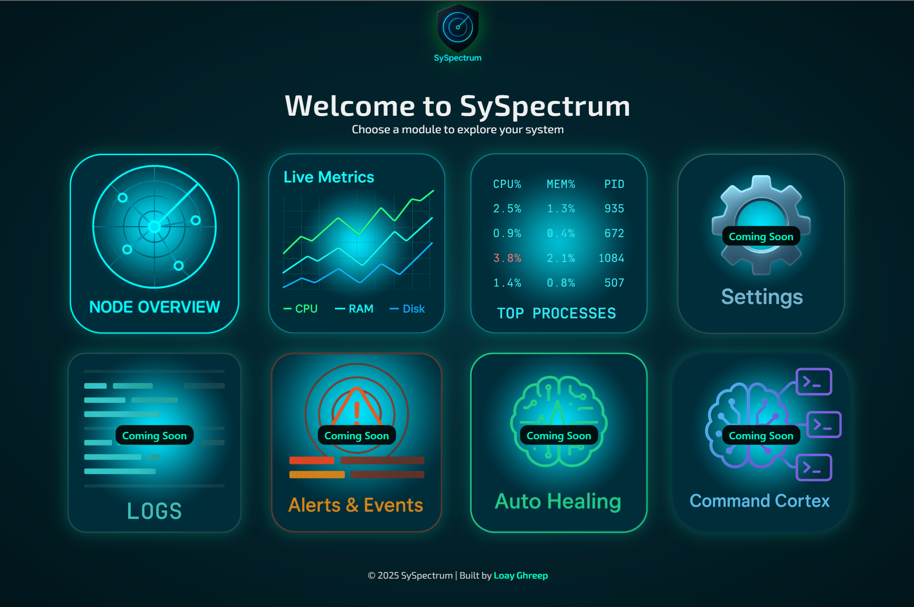
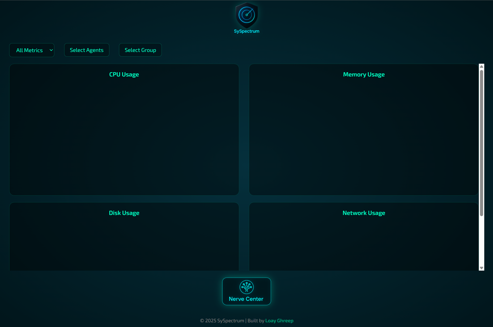
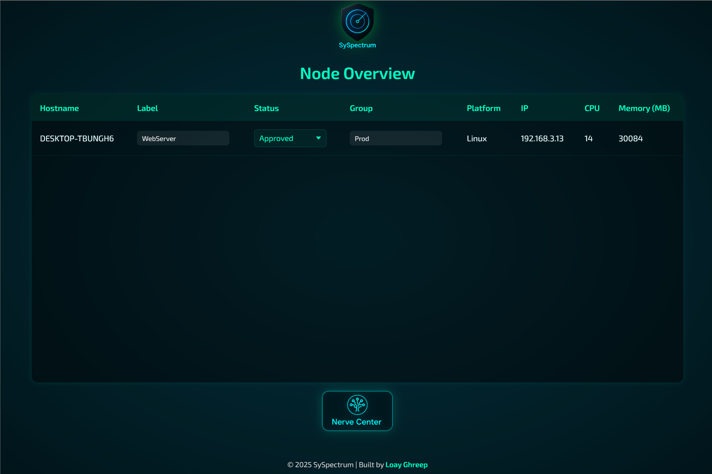

<p align="center">
  
</p>

# 🚨 Deprecation Notice

This repository has been deprecated as of the 1st of June 2025.
Due to strategic prioritization and focus on new projects, further development of Syspectrum has been paused till further notice.

# 🛰️ Syspectrum

**Syspectrum** is a high-performance, agent-based system monitoring platform built for developers, sysadmins, and DevOps engineers who want **real-time, low-footprint, no-nonsense telemetry** — without vendor lock-in or bloat.

> 🔧 Built with Node.js agent, NeDB backend, and Flutter web dashboard.  
> 📡 Deploy it in seconds. Watch everything. Own your data.

---

|  |  |
|-----------------------------------------|-----------------------------------------|
|  |  |

---

## 📚 Table of Contents

- [🚀 Why Syspectrum?](#-why-syspectrum)
- [🧠 Architecture Overview](#-architecture-overview)
- [🧩 Project Roadmap Phases](#-project-roadmap-phases)
- [🧑‍💻 About the Author](#-about-the-author)
- [🧾 License](#-license)

---

## 🚀 Why Syspectrum?

> “I couldn’t find a modern, lightweight, easy-to-deploy monitoring tool that wasn’t bloated or locked behind a paywall — so I built one.”

- ✅ **Node.js Native Agent** — Ultra-portable and distro-agnostic
- 📊 **Real-Time Telemetry** — CPU, Memory, Disk, Network, Processes, Temperature
- 🔌 **Modular Stack** — Node backend + Flutter dashboard + structured API
- 📁 **Clean JSON Output** — Easy integration with CI/CD, scripts, webhooks
- 🔒 **Self-Hosted, Secure** — Logs and command execution are opt-in only
- 🧪 **Fully Offline-Capable** — Designed for bare metal, cloud, lab, or edge
- 🚫 **No Vendor Lock-In** — Yours. Forever.

---

## 🧠 Architecture Overview

```
    +------------------+     Push API    +------------------+
    |  Node.js Agent   |  ────────────▶ |  Backend Server   |
    |------------------|                 |------------------|
    |  Shell Metrics   |                 |  NeDB Storage    |
    |  JSON Telemetry  |                 |  RESTful API     |
    +------------------+                 +--------▲---------+
                                                   │
                                                   │
                                          Flutter Web Dashboard
```

---

## 🧩 Project Roadmap Phases

### 🔹 **Phase 1 — Agent Layer (✅ Complete)**
> _“The brain at the edge.”_

- Cross-distro Node.js agent
- Shell-based metric collectors (CPU, memory, disk, network, temperature, processes)
- Modular `modules/` and `utils/` structure
- Auto dependency installer (OS + Node)
- Winston-based logging to file + console
- Dynamic config support (`config.js`)
- Self-healing background runtime via `screen`
- Full bash CLI: `install.sh`, `start.sh`, `stop.sh`
- JSON output ready for API push  
💡 **Outcome**: Plug-and-play metric engine, zero GUI, fully autonomous

---

### 🔹 **Phase 2 — Backend API Receiver**
> _“The always-listening orchestrator.”_

- Lightweight Node.js + Express backend
- REST API to receive agent pushes (`/api/telemetry`)
- Validates payload, stores in memory
- Basic health/status endpoints
- Supports multiple agents via hostname or ID
- 🧠 Optional: agent registration endpoint  
💡 **Outcome**: Central command node receiving structured data

---

### 🔹 **Phase 3 — Data Storage & Persistence**
> _“Memory becomes history.”_

- NeDB for zero-config embedded persistence
- Optional MongoDB/PostgreSQL support (future-ready)
- Automatic DB rotation or archival logic
- Timestamped metric logs for each agent
- Internal telemetry audit (agent uptime, gaps, anomalies)  
💡 **Outcome**: Persisted observability data, future-queryable

---

### 🔹 **Phase 4 — Containerization / Serviceization**
> _“Ship it, anywhere.”_

- Dockerfile for agent + backend
- Docker Compose with health checks + volumes
- Optional `.service` files for systemd
- CI-ready deploy script
- Dev/Prod ENV separation  
💡 **Outcome**: Cloud-native, host-ready, cron-free reliability

---

### 🔹 **Phase 5 — Dashboard UI (Flutter Web)**
> _“Vision to match the brain.”_

- Flutter web app (self-hosted or embeddable)
- Live dashboard of agents and metrics
- Filter by hostname, time, metric type
- Color-coded health status
- JSON viewer / table switch
- Real-time push or polling display  
💡 **Outcome**: Clean visual layer over agent data

---

### 🔹 **Phase 6 — Security & RBAC**
> _“Access is power.”_

- User auth (JWT + refresh)
- Admin / Operator roles
- Agent auth token rotation + signing
- HTTPS / reverse proxy guidelines
- Rate-limiting and IP whitelisting
- Audit log for sensitive actions  
💡 **Outcome**: Hardened, auditable, multi-user safe system

---

### 🔹 **Phase 7+ — PRO Tier (Commercial)**
> _“Beyond the edge.”_

- 🔐 Remote command execution from dashboard
- 🧠 Remote config + agent hot patching
- 🔁 Agent version sync + self-update
- 📡 Push-to-cloud or remote relay support
- 📊 Advanced alerts, SLA rules, threshold triggers
- 🔔 Notifications (Telegram, Slack, Webhook)
- 📍 GPS/device metadata per agent
- 🧩 Plugin system for extending modules
- 💰 Licensing engine + offline key validation  
💡 **Outcome**: Enterprise SaaS capability, investor-grade power

---

## 🧑‍💻 About the Author

**Loay Ghreep** — DevOps & Systems Engineer from Egypt.
- 🛠️ Specialized in infrastructure, automation, observability, and production-level engineering and architecture  
- 💼 [LinkedIn](https://www.linkedin.com/in/loay-ghreep-379580112/)  

> *"I don’t just use tools — I build infrastructure others rely on."*

---

## 🧾 License

**MIT License**  
Use freely, contribute openly.  
Commercial features (Phase 7+) will be available under private licensing.
